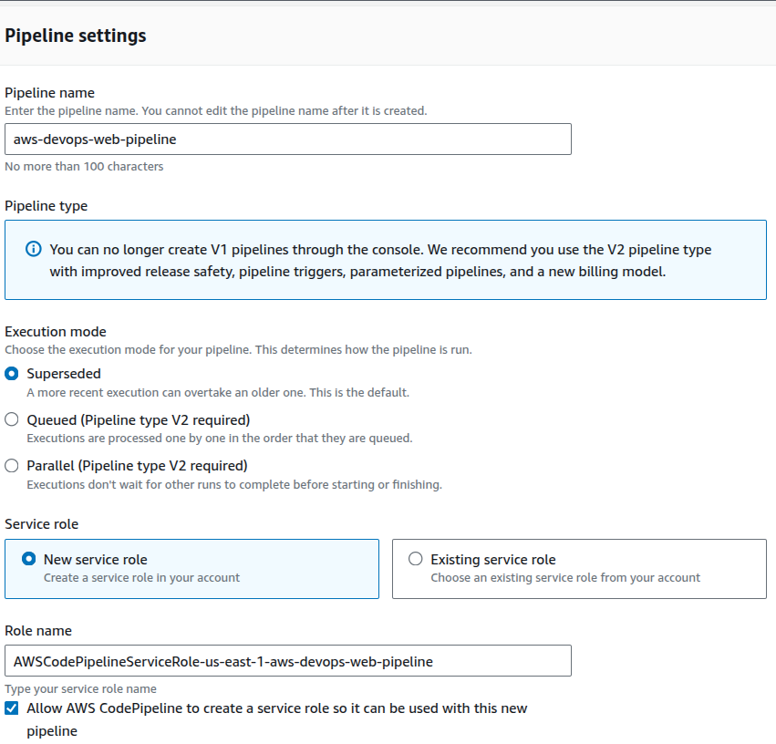
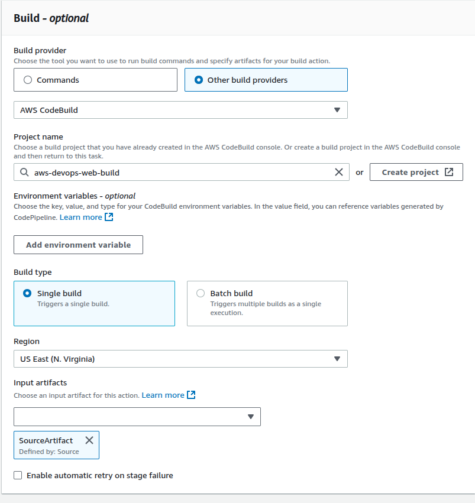
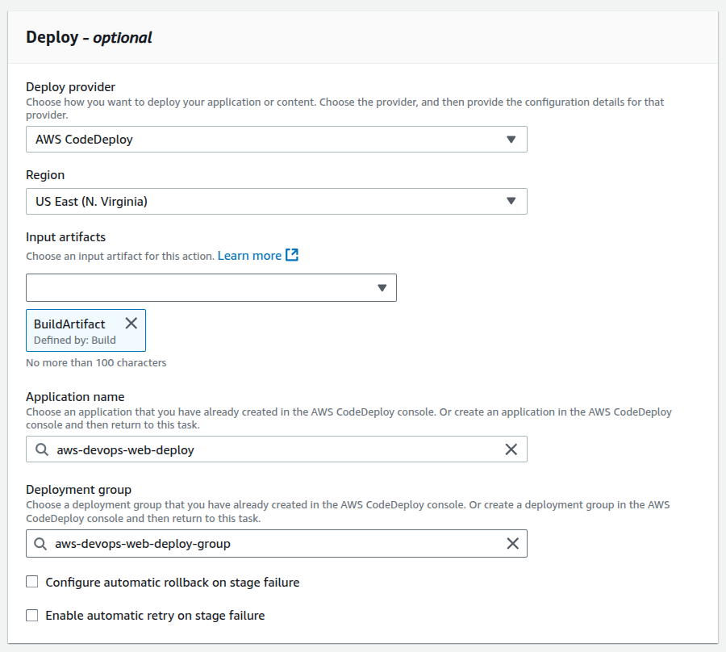
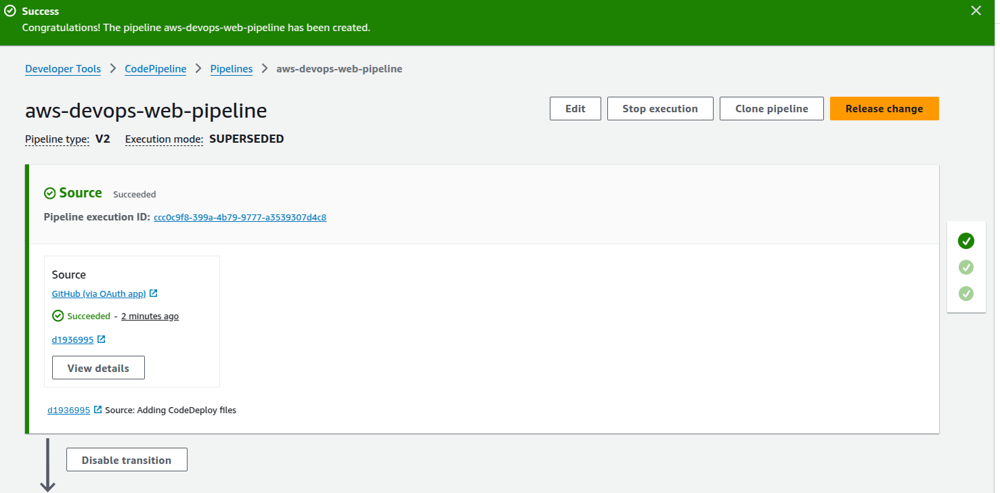

# Projeto AWS-DevOps

## Índice
- [Sobre o Projeto](#sobre-o-projeto)
- [Arquitetura Geral](#arquitetura-geral)
- [Serviços AWS Utilizados](#serviços-aws-utilizados)
- [Etapas do Projeto](#etapas-do-projeto)
   - [1 - Configurar uma aplicação web na nuvem](#1---configurar-uma-aplica%C3%A7%C3%A3o-web-na-nuvem)
   - [2 - Conectar um repositório GitHub à AWS](#2---conectar-um-repositorio-github-a-aws)
   - [3 - Proteger as dependências com AWS CodeArtifact](#3---proteger-as-dependencias-com-aws-codeartifact)
   - [4 - Empacotar uma aplicação com AWS CodeBuild](#4---empacotar-uma-aplicacao-com-aws-codebuild)
   - [5 - Implantar uma aplicação com AWS CodeDeploy](#5---implantar-uma-aplicacao-com-aws-codedeploy)
   - [6 - Pipeline CI/CD com AWS CodePipeline](#6---pipeline-cicd-com-aws-codepipeline)

## Sobre o Projeto
Este projeto tem como objetivo criar um pipeline CI/CD para construir e implantar uma aplicação web simples utilizando 
serviços da AWS voltados para DevOps. Para facilitar o aprendizado, o projeto foi dividido em seis etapas, proporcionando uma 
abordagem prática e estruturada, além de permitir uma melhor compreensão e aplicação dos serviços da AWS e das tecnologias utilizadas.

## Arquitetura Geral


## Serviços AWS Utilizados
AWS IAM: criar usuário, configurar políticas e roles. <br> 
Amazon EC2: servir como ambiente de desenvolvimento e ambiente de produção. <br>
AWS CodeArtifact: salvar cópias das dependências da aplicação web. <br>
AWS CodeBuild: compilar e empacotar o código-fonte da aplicação em um arquivo WAR. <br>
AWS CodeDeploy: implantar o arquivo WAR no servidor de produção. <br>
AWS CloudFormation: criar a instância e a VPC do ambiente de desenvolvimento. <br>
AWS CodePipeline: automatizar as integrações entre GitHub, CodeBuild e CodeDeploy. <br>

## Etapas do Projeto
### 1 - Configurar uma aplicação web na nuvem
#### Configurar um usuário IAM:
Por questões de segurança, acesse o console da AWS com seu usuário IAM. Caso ainda não tenha um, consulte a 
[documentação oficial](https://docs.aws.amazon.com/pt_br/streams/latest/dev/setting-up.html#:~:text=Para%20criar%20um%20grupo%20de,Administrators%20e%20escolha%20Pr%C3%B3xima%20etapa.) 
para criá-lo.

#### Lançar uma instancia EC2:
Para hospedar o ambiente de desenvolvimento, é necessária a criação de uma instância EC2.
Consulte a [documentação oficial](https://docs.aws.amazon.com/pt_br/AWSEC2/latest/UserGuide/tutorial-launch-a-test-ec2-instance.html) 
para lançar a instância, configurar um par de chaves e a rede da instância. <br>


#### Estabelecer uma conexão SSH com a instância EC2:
Caso seja necessário, utilize o comando `chmod 400 arquivo.pem` para alterar as permissões do seu arquivo .pem. <br>
Para conectar à instância, utilize  
`ssh -i [CAMINHO PARA O SEU ARQUIVO .PEM] ec2-user@[SEU DNS PÚBLICO IPV4]`

#### Instalar o Apache Maven e o Amazon Corretto 8 para gerar uma aplicação web simples:
Instalar Apache Maven na Instância EC2:
```
wget https://archive.apache.org/dist/maven/maven-3/3.5.2/binaries/apache-maven-3.5.2-bin.tar.gz
sudo tar -xzf apache-maven-3.5.2-bin.tar.gz -C /opt
echo "export PATH=/opt/apache-maven-3.5.2/bin:$PATH" >> ~/.bashrc
source ~/.bashrc
```

Instalar Amazon Corretto 8:
``` 
sudo dnf install -y java-1.8.0-amazon-corretto-devel
export JAVA_HOME=/usr/lib/jvm/java-1.8.0-amazon-corretto.x86_64
export PATH=/usr/lib/jvm/java-1.8.0-amazon-corretto.x86_64/jre/bin/:$PATH
```

#### Executar os comandos Maven no terminal para gerar uma aplicação web em Java:
```
mvn archetype:generate \
   -DgroupId=com.awsdevops.app \
   -DartifactId=aws-devops-web-project \
   -DarchetypeArtifactId=maven-archetype-webapp \
   -DinteractiveMode=false
```

#### Conectar o VSCode à instância EC2 usando o Remote-SSH:
Instalar a extensão [Remote-SSH](https://marketplace.visualstudio.com/items?itemName=ms-vscode-remote.remote-ssh) 
no VSCode para que você possa ver e editar a app web que acabou de criar. <br>


### 2 - Conectar um repositorio GitHub a AWS
#### Instalar o Git na instância EC2:
```
sudo dnf update -y
sudo dnf install git -y 
```

#### Conectar o seu projeto de aplicação web à um repositório GitHub
Criar um repositório no seu GitHub e fazer commit e push das alterações. <br>


### 3 - Proteger as dependencias com AWS CodeArtifact
#### Criar seu domínio e repositório:
Domínio: é como uma pasta principal para organizar e armazenar repositórios do seu projeto. Armazena artefatos e é acessado por uma URL. <br>


Repositório local: é onde você guarda os pacotes de software que já foram instalados no seu ambiente de desenvolvimento. <br>
Repositório upstream público: é o local onde o Maven busca pacotes que não estão no repositório local. <br>


#### Conectar o repositório CodeArtifact ao VSCode:
No console  do CodeArtifact visualize  as instruções de conexão. O passo 3 deve ser copiado e colado no VSCode. <br>


Com o comando `echo $'<settings>\n</settings>' > settings.xml` crie o arquivo de configuração, que diz ao Maven onde encontrar as dependências e como se conectar aos repositórios corretos. <br>
Copie os passos 4,5 e 6 dentro desse arquivo e salve o arquivo.

#### Testar a conexão entre CodeArtifact e VSCode:
Neste teste o Maven vai buscar e baixar todas as dependências necessárias para o projeto, seja do repositório upstream ou do Maven Central Repository, e elas serão armazenadas como cópias dentro do CodeArtifact. <br>
Utilize o comando `mvn -s settings.xml compile` para compilar a aplicação. <br>
Conferir se as dependências estão no CodeArtifact.


#### Configure uma política do IAM para usar o CodeArtifact:
Outros serviços deste projeto precisam ter acesso ao CodeArtifact. Esta política IAM serve para permitir que esses serviços acessem os recursos armazenados no repositório do CodeArtifact.
(consumer-policy)
```
{
 "Version": "2012-10-17",
 "Statement": [
     {
         "Effect": "Allow",
         "Action": [ "codeartifact:GetAuthorizationToken",
                     "codeartifact:GetRepositoryEndpoint",
                     "codeartifact:ReadFromRepository"
                     ],
         "Resource": "*"
     },
     {      
         "Effect": "Allow",
         "Action": "sts:GetServiceBearerToken",
         "Resource": "*",
         "Condition": {
             "StringEquals": {
                 "sts:AWSServiceName": "codeartifact.amazonaws.com"
             }
         }
     }
 ]
}
```

### 4 - Empacotar uma aplicacao com AWS CodeBuild
#### Criar um bucket do S3:


#### Criar um projeto de build no CodeBuild:
Para a criação do projeto de build, temos algumas etapas: <br>
Project configuration: configurações gerais do projeto de build.


Source panel: localização do código que o CodeBuild irá buscar, compilar e empacotar em um arquivo WAR. Neste caso, será o GitHub.


Environment panel: ambiente dedicado que será usado para compilar, testar e empacotar o código, mas não será o servidor final que hospedará a aplicação.


Buildspec panel: opção de utilizar o arquivo buildspec, que informa ao CodeBuild quais comandos executar durante o processo de build, como instalar dependências e compilar o código. Ainda não criamos esse arquivo, mas faremos isso em breve.


Artifacts panel: configurar o CodeBuild para empacotar todos os artefatos (arquivos gerados pelo CodeBuild durante o processo de build do seu projeto) em um arquivo WAR e armazená-lo no bucket S3 criado.


Logs panel: ativar logs do CloudWatch para o CodeBuild permite monitorar o processo de build, identificar problemas e entender o que funcionou ou não.

 <br>

 <br>

#### Criar o arquivo buildspec.yml da sua aplicação web:
Este arquivo informa ao CodeBuild quais comandos executar durante o processo de build, como instalar dependências e compilar o código. <br>
No VSCode crie o arquivo buildspec.yml na raiz do seu projeto.
Salve o arquivo e faça commit e push das suas alterações, para garantir que o CodeBuild use os arquivos do repositório CodeCommit, não diretamente do VSCode. <br>
Visualize o arquivo buildspec.yml [aqui](buildspec.yml).

#### Modificando a IAM role do seu CodeBuild:
Modificar a IAM role do CodeBuild para conceder as permissões necessárias para acessar o repositório CodeArtifact e permitir que o CodeBuild busque os pacotes requeridos, garantindo a conclusão do processo de build da aplicação. <br>
Na role vamos anexar a política que criamos na etapa do CodeArtifact (consumer-policy).

 <br>

#### Testar o projeto de build:
Executar o primeiro build usando o CodeBuild. <br>

 <br>

Após a conclusão verifique o arquivo WAR criado no bucket S3. <br>

 <br>

### 5 - Implantar uma aplicacao com AWS CodeDeploy
#### Criar uma instância EC2 e VPC com AWS CloudFormation:
No início do projeto, uma instância EC2 foi configurada manualmente para o ambiente de desenvolvimento. Agora, será criada uma nova instância EC2 para o ambiente de produção e uma VPC para gerenciar o tráfego de rede e o acesso à aplicação. Todo o processo será automatizado para maior eficiência. <br>
Faça upload de um template para criar a infraestrutura e crie a stack no CloudFormation. <br>

 <br>

 <br>

 <br>

#### Criar scripts para executar a aplicação:
O CodeDeploy executará esses scripts para configurar e implantar sua aplicação web na instância EC2 de destino. <br> 
install_dependencies.sh:  instala as dependências de sistema, como Apache Tomcat e HTTPD, garantindo um ambiente consistente sempre que a aplicação for implantada. <br>
start_server.sh: inicia os serviços Tomcat e HTTPD na instância EC2, garantindo que os serviços necessários estejam ativos e funcionando. <br>
stop_server.sh: para os serviços Tomcat e HTTPD na instância EC2, garantindo que versões antigas dos servidores sejam desativadas antes de um novo deploy. <br>
appspec.yml: orienta o CodeDeploy sobre os passos e arquivos necessários para um deploy. <br>
Visualize os arquivos de script [aqui](./scripts/) e o arquivo appsec.yml [aqui](appspec.yml). <br>
É necessário incluir os scripts na seção artifacts do arquivo buildspec.yml
```
- appspec.yml
- scripts/**/*
```

Faça o commit das alterações.

 <br>

Execute novamente o processo de build, para garantir que todos os novos arquivos e alterações sejam incluídos no arquivo zip.

#### Criar a IAM role do CodeDeploy:
Criar a IAM role do CodeDeploy para conceder permissão ao CodeDeploy para realizar implantações em uma instância EC2, utilizando a política gerenciada AWS AWSCodeDeployRole.

 <br>

#### Criar uma aplicação do CodeDeploy:
Funciona como uma pasta que contém todas as configurações necessárias para uma implantação. Um modelo para implantar uma aplicação web, para que você não precise configurar todas as configurações do zero a cada vez.

 <br>

#### Criar um deployment group:
Define as instruções específicas para um cenário de implantação particular. Ele especifica quais servidores usar, como implantar e quais configurações aplicar para esse caso específico.

 <br>

#### Criar seu deployment:

 <br>

 <br>

### 6 - Pipeline CICD com AWS CodePipeline
#### Configurar seu pipeline:
O pipeline serve paraa automatizar as integrações entre o GitHub, CodeBuild e CodeDeploy. Sua configuração é dividida nas seguintes etapas:<br>
pipeline settings: definições gerais do pipeline. <br>

 <br>

source provider: informar ao CodePipeline que o código fonte da aplicação está no GitHub. <br>

 <br>

build stage: informar ao CodePipeline que configuramos a etapa de build do pipeline no CodeBuild. <br>

 <br>

deploy stage:  informar ao CodePipeline que configuramos a etapa de deploy no CodeDeploy. <br>

 <br>

Certifique-se de que todas as três etapas do seu pipeline sejam concluídas com sucesso. <br> 

 <br>

 <br>

#### Lançar uma Alteração:
Agora que temos um pipeline CI/CD totalmente gerenciado, vamos fazer uma alteração na aplicação para testar se tudo está funcionando corretamente. <br>

 <br>

 <br>

#### Acionar um Rollback:
Significa retornar a uma versão anterior e funcional da sua aplicação, é útil quando o novo código já está correto, mas a implantação falhou. <br>
Neste caso, o rollback foi realizado apenas na fase de implantação, então a aplicação no ambiente de produção voltou a um estado anterior, antes de atualizar o arquivo index.jsp. Porém, a etapa "Commit" ainda reflete as últimas alterações feitas nesse arquivo. <br> 
Ou seja, o código fonte foi atualizado, mas a implantação foi revertida.

 <br>

#### Release Change:
Release change vai atualizar as três etapas com a versão mais recente do código fonte, e você verá as mudanças refletidas no servidor de produção. <br>

 <br>
